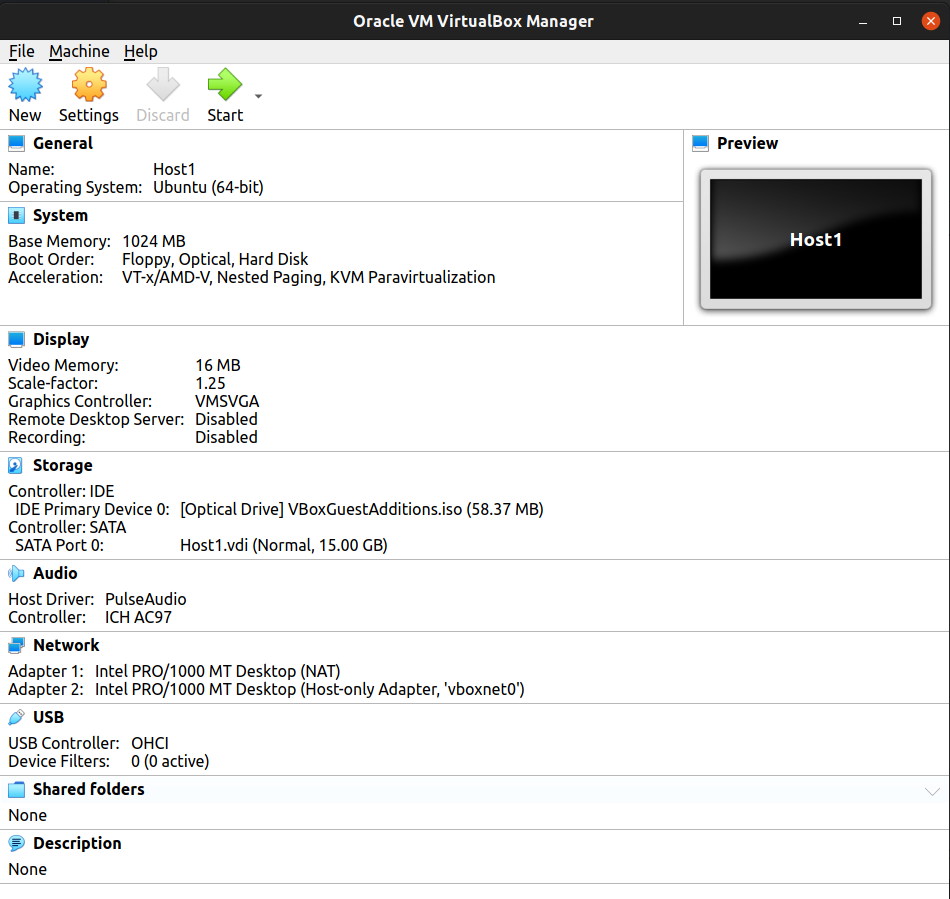
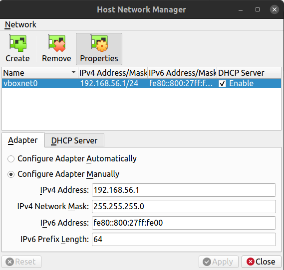
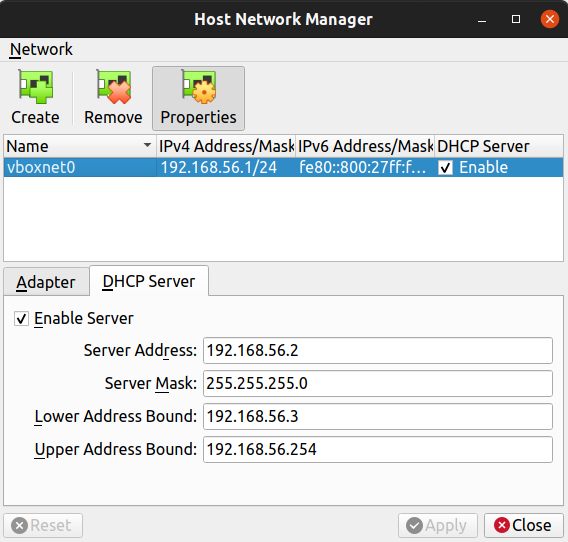
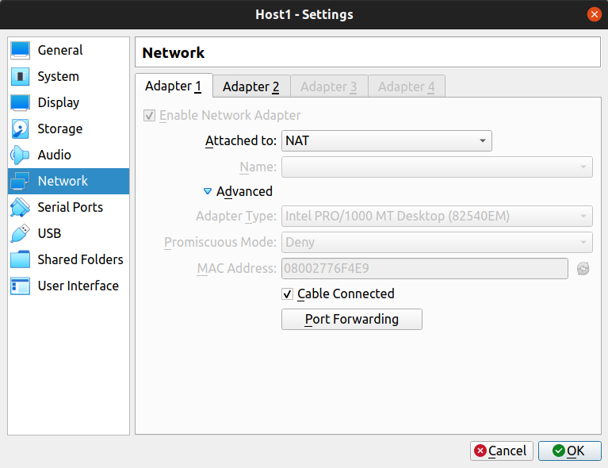
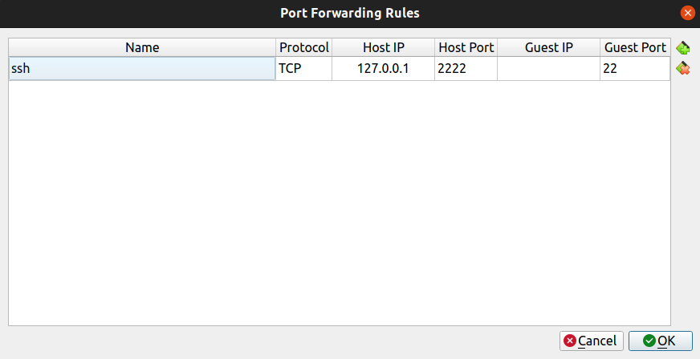

# Software and Utilities

## Install GNOME tweak

```bash
sudo add-apt-repository universe
sudo apt install gnome-tweak-tool
```

Modify the settings of GNOME as

<p align='center'>
    
</p>

## VS Code

- Download VS code from (.deb file) https://code.visualstudio.com/Download
- Log into github first in browser.
- Log into Github account and **merge** or **replace the local** the settings.
- Navigate to `/home/himanshu/.vscode/extensions/alexcvzz.vscode-sqlite-0.13.0/bin` and change permission of file as `chmod +x sqlite-v3.26.0-linux-x64`. Now we can view sqlite db of django in VS Code itself. If required download `sudo apt install sqlite` before changing permmission.

## Setup Git and GitHub

Install

```bash
sudo apt update
sudo apt install git
git --version
```

Setup

```bash
git config --global user.name "Your Name"
git config --global user.email "youremail@yourdomain.com"
```

Check for existing SSH keys. Look for a public key

```bash
$ ls -al ~/.ssh
# Lists the files in your .ssh directory, if they exist
```

Generate a new SSH keys

```bash
$ ssh-keygen -t ed25519 -C "your_email@example.com"
```

Copy the public key to github account

```bash
himanshu in ~ : cd ~/.ssh/
himanshu in .ssh : ls
id_ed25519  id_ed25519.pub  known_hosts
himanshu in .ssh : cat id_ed25519.pub 
ssh-ed25519 AAAAC3NzaC1lZsdfasdfasdfasdfasdfsM1K1mn22vEwxr3w+x8 py.himanshu.patel@gmail.com
```

## Install VLC

```bash
sudo snap install vlc
```

## Setup Ubuntu Server on Oracle VM and connect to VM via SSH on host.

1. Download Ubuntu ISO for Ubuntu Server from here https://ubuntu.com/download/server.
2. Download Oracle VM for respective OS https://www.virtualbox.org/wiki/Linux_Downloads.
3. Setup a new VM with the Ubuntu ISO and choose around 1GB of RAM and 15 GB fo Space.

<p align="center">
  
</p>

4. Add a Host Network in VM. This network added in VM is also reflected in the host machine.
```bash
# install net-tools for ifconfig command
$ sudo apt install net-tools
```

<p align="center">
  
  
</p>

Now after starting VM check, your host system will have below interface.

```bash
vboxnet0: flags=4163<UP,BROADCAST,RUNNING,MULTICAST>  mtu 1500
        inet 192.168.56.1  netmask 255.255.255.0  broadcast 192.168.56.255
        inet6 fe80::800:27ff:fe00  prefixlen 64  scopeid 0x20<link>
        inet6 fe80::800:27ff:fe00:0  prefixlen 64  scopeid 0x20<link>
        ether 0a:00:27:00:00:00  txqueuelen 1000  (Ethernet)
        RX packets 0  bytes 0 (0.0 B)
        RX errors 0  dropped 0  overruns 0  frame 0
        TX packets 75  bytes 12291 (12.2 KB)
        TX errors 0  dropped 0 overruns 0  carrier 0  collisions 0
```
Also we can check the ip address assigned to the VM by below method.
```bash
# in VM terminal
host1_user@host1server:~$ ip addr
1: lo: <LOOPBACK,UP,LOWER_UP> mtu 65536 qdisc noqueue state UNKNOWN group default qlen 1000
    link/loopback 00:00:00:00:00:00 brd 00:00:00:00:00:00
    inet 127.0.0.1/8 scope host lo
       valid_lft forever preferred_lft forever
    inet6 ::1/128 scope host 
       valid_lft forever preferred_lft forever
2: enp0s3: <BROADCAST,MULTICAST,UP,LOWER_UP> mtu 1500 qdisc fq_codel state UP group default qlen 1000
    link/ether 08:00:27:76:f4:e9 brd ff:ff:ff:ff:ff:ff
    inet 10.0.2.15/24 brd 10.0.2.255 scope global dynamic enp0s3
       valid_lft 85365sec preferred_lft 85365sec
    inet6 fe80::a00:27ff:fe76:f4e9/64 scope link 
       valid_lft forever preferred_lft forever
3: enp0s8: <BROADCAST,MULTICAST> mtu 1500 qdisc noop state DOWN group default qlen 1000
    link/ether 08:00:27:8f:d0:98 brd ff:ff:ff:ff:ff:ff
```
See the last `enp0s8` this is the host only connection of VM with host machine.

Also add a rule in VM for port forwarding. Choose the port forwarding option on adapter1 of VM with NAT interface.

<p align="center">
  
<!-- </p>
<p align="center"> -->
  
</p>


4. Now connect with using the `ssh` command from host. But before this install `ssh-server` on both host and VM.
```bash
# install tool
$ sudo apt-get install openssh-server
# enable the ssh service by typing 
$ sudo systemctl enable ssh
# start the ssh service by typing 
$ sudo systemctl start ssh
# make sure ssh service is up and running on both host and VM
$ sudo systemctl status ssh
```
SSH from host to VM
```bash
# test it by login into the system using ssh user@server-name or ssh user@server-ip 
# add the specific port using -p flag
$ ssh host1_user@localhost -p 2222
# provide VM machine password
host1_user@host1server:~$   # connected
```
Here localhost will try to connect of port 2222 of 127.0.0.1 but that port is forwarded on port 22 of VM.
