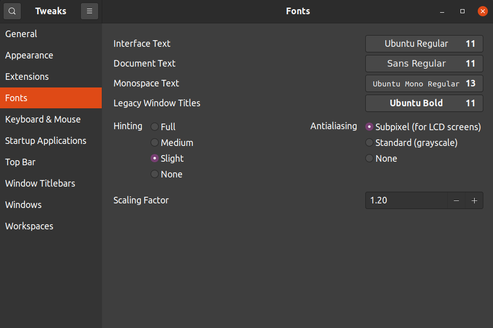

# Software and Utilities

## Install GNOME tweak

```bash
sudo add-apt-repository universe
sudo apt install gnome-tweak-tool
```

Modify the settings of GNOME as

<p align='center'>
    
</p>

## VS Code

1. Download VS code from (.deb file) https://code.visualstudio.com/Download
2. Log into github first in browser.
3. Log into Github account and **merge** or **replace the local** the settings.

## Setup Git and GitHub

Install

```bash
sudo apt update
sudo apt install git
git --version
```

Setup

```bash
git config --global user.name "Your Name"
git config --global user.email "youremail@yourdomain.com"
```

Check for existing SSH keys. Look for a public key

```bash
$ ls -al ~/.ssh
# Lists the files in your .ssh directory, if they exist
```

Generate a new SSH keys

```bash
$ ssh-keygen -t ed25519 -C "your_email@example.com"
```

Copy the public key to github account

```bash
himanshu in ~ : cd ~/.ssh/
himanshu in .ssh : ls
id_ed25519  id_ed25519.pub  known_hosts
himanshu in .ssh : cat id_ed25519.pub 
ssh-ed25519 AAAAC3NzaC1lZsdfasdfasdfasdfasdfsM1K1mn22vEwxr3w+x8 py.himanshu.patel@gmail.com
```

## Install VLC

```bash
sudo snap install vlc
```
